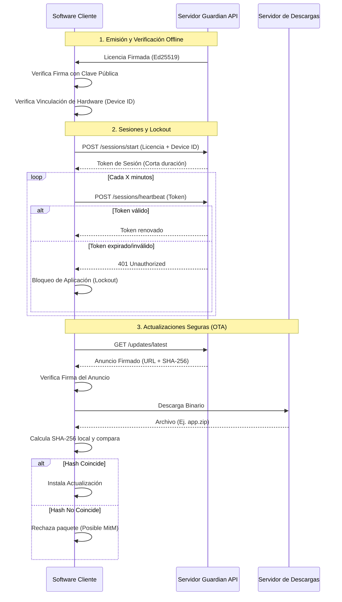

# GuardianLicense 🛡️

Un motor moderno de licenciamiento de software basado en **criptografía asimétrica**, vinculación de hardware (*hardware-binding*) y **sesiones en tiempo real**.

## 🎯 Sobre este proyecto
Este es un proyecto de portafolio educativo diseñado para demostrar patrones reales de arquitectura de licenciamiento y seguridad en software comercial. Todo el código, producto y datos son ficticios y sirven exclusivamente para exhibir buenas prácticas de diseño de backend y criptografía aplicada.

---

## 🔄 Ciclo de Vida del Cliente (Flujo de Arquitectura)



---

## 🏗️ Decisiones de Arquitectura

- **Ed25519 (Asimétrico) vs HMAC (Simétrico):** Al usar criptografía asimétrica, el cliente solo necesita conocer la clave **pública** para verificar la licencia. Incluso si un atacante descompila el binario del cliente, no obtendrá la clave privada, por lo que es matemáticamente imposible que falsifique o modifique licencias.
- **Vinculación de Hardware (Hardware Binding):** La firma digital valida que la licencia fue emitida por nosotros, pero no impide que un usuario la copie y se la dé a 10 amigos. Vincular la licencia a un `device_id` (MAC/Disco/Hostname) asegura que una licencia válida solo funcione en la máquina física autorizada.
- **Sesiones Cortas (Heartbeats):** Una licencia de largo plazo (ej. 1 año) es difícil de revocar offline. Exigir un *heartbeat* recurrente con un token de corta duración permite al servidor revocar el acceso casi en tiempo real si detecta abuso, sin tener que esperar a que expire la licencia original.
- **Verificación OTA en 2 Capas:** Se separa la confianza del canal de entrega. El anuncio se firma para garantizar **autenticidad** (quién dice que hay una actualización), y el paquete descargado se valida por SHA-256 para **integridad**. Esto permite usar CDNs inseguros y baratos para distribuir archivos pesados, manteniendo una seguridad impenetrable frente a ataques MitM.

---

## 📂 Estructura del Proyecto

```text
guardian-license/
├── README.md
├── server/
│   ├── crypto.py                # Generación Ed25519, canonización JSON y firmas
│   ├── models.py                # Esquemas Pydantic
│   ├── sessions.py              # Almacén de sesiones en memoria y control de heartbeat
│   ├── updates.py               # Catálogo de releases y generación de firmas OTA
│   └── main.py                  # API REST FastAPI (licencias, sesiones y OTA)
├── client-sdk/
│   ├── verifier.py              # Motor offline de validación criptográfica
│   ├── hardware_id.py           # Generador determinista de huella de hardware
│   ├── session.py               # Supervisor de sesión y bloqueo por expiración (Lockout)
│   └── update_verifier.py       # Verificador de integridad y autenticidad de actualizaciones
└── examples/
    ├── demo_verify.py           # Flujo criptográfico (emisión, verificación y manipulación)
    ├── demo_hardware_binding.py # Prueba de vinculación de hardware y bloqueo de copias
    ├── demo_session_lifecycle.py# Demostración de heartbeat y bloqueo por expiración
    └── demo_update_verification.py # Demostración de OTA (Anuncio y validación de integridad)
```

---

## 🚀 Inicio Rápido

### 1. Requisitos
```bash
pip install cryptography fastapi pydantic uvicorn
```

### 2. Ejecutar Demostraciones

> 💡 **Nota:** Todos los scripts de demostración son completamente autocontenidos. Simulan la interacción cliente-servidor y la generación de claves en memoria, por lo que **no es necesario** levantar el servidor FastAPI (`uvicorn`) por separado para probarlos.

```bash
# Prueba 1: Núcleo Criptográfico (Firma y Verificación)
python examples/demo_verify.py

# Prueba 2: Vinculación a Dispositivo (Hardware Binding)
python examples/demo_hardware_binding.py

# Prueba 3: Sesiones y Bloqueo por Expiración (Heartbeat Lifecycle)
python examples/demo_session_lifecycle.py

# Prueba 4: Verificación de Actualizaciones Seguras (OTA)
python examples/demo_update_verification.py
```

---

## 💻 Vinculación a Dispositivo (Hardware Binding)

### ¿Qué es y por qué se utiliza?
La firma digital asimétrica garantiza que una licencia es legítima y no ha sido adulterada. Sin embargo, por sí sola **no impide que un usuario legítimo copie el archivo de licencia y lo distribuya a 50 computadoras diferentes**.

El **Hardware Binding** resuelve este problema atando criptográficamente la validez de la licencia a la identidad física de una máquina específica (`device_id`):

1. **Recolección de Parámetros:** El SDK del cliente extrae identificadores del equipo (dirección MAC, número de serie de disco/placa y hostname).
2. **Generación de Huella (Hash):** Se calcula un hash unívoco SHA-256 de los componentes combinados en formato `DEV-XXXXXXXX-XXXXXXXX-XXXXXXXX`.
3. **Inclusión en el Payload:** El servidor firma el `device_id` como parte inseparable del payload de la licencia.
4. **Validación Local:** Al iniciar, el cliente regenera su propia huella y la compara con la del payload firmado. Si difieren, la ejecución se bloquea inmediatamente, incluso si la firma criptográfica es 100% auténtica.

### Limitaciones Conocidas y Mitigación en Producción
* **Modificaciones Legítimas de Hardware:** Si un usuario reemplaza componentes de su equipo (por ejemplo, cambia el disco duro o la tarjeta de red), la huella calculada cambiará y la licencia dejará de coincidir.
* **Mecanismos de Producción:**
  * **Flujos de Re-activación:** En sistemas comerciales reales se implementa un endpoint de transferencia de licencias que permite a los usuarios revocar la máquina anterior y emitir una nueva para el nuevo hardware (con límites por año).
  * **Algoritmos de Tolerancia (Fuzzy Matching):** En lugar de un hash estricto único, algunos motores comerciales calculan hashes por componente individual (CPU, BIOS, Placa, Disco) y permiten la validación si al menos 3 de los 4 componentes coinciden.
  *(Estos flujos de re-activación y coincidencia difusa quedan fuera del alcance de este demo educativo).*

---

## ⏱️ Sesiones de Corta Duración y Bloqueo por Expiración

### ¿Qué problema resuelve?
Una licencia de largo plazo (ej. anual o perpetua) permite validar el software de forma offline, pero introduce un problema crítico de negocio: **¿qué ocurre si el cliente cancela su suscripción o comete fraude al segundo mes?**

Si la validación fuera puramente offline, el software seguiría funcionando libremente hasta que expire el año completo. Las **sesiones de corta duración** resuelven esto introduciendo supervisión activa en tiempo real:

1. **Inicio de Sesión:** Tras validar la licencia local, el software solicita al servidor un token de sesión efímero (ej. 5 a 15 minutos de validez).
2. **Ciclo de Heartbeat:** El cliente ejecuta un hilo en segundo plano que envía una señal periódica (*heartbeat*) antes de que expire la sesión, extendiendo la validez.
3. **Bloqueo Inmediato (Lockout):** Si el servidor revoca la sesión o el cliente pierde la conexión y no logra renovar antes del límite, el `SessionManager` activa un bloqueo de ejecución (`SessionExpiredError`), impidiendo que el usuario continúe utilizando las funciones protegidas.
4. **Rechazo de Renovación Tardía:** Si llega un heartbeat posterior a la expiración, el servidor lo rechaza de plano, obligando a una re-autenticación completa.

### Trade-off y Manejo de Tolerancia Offline
* **Trade-off:** Requiere que el software cliente tenga conexión periódica al servidor para mantener la sesión viva.
* **Mitigación en Producción (Período de Gracia):** Para evitar bloquear a un usuario legítimo por una caída temporal de su red local, los sistemas de producción implementan una **tolerancia de gracia offline** (ej. permitir 24 o 48 horas de operación desconectada antes de exigir un heartbeat forzoso). *(Este mecanismo de tolerancia extendida queda fuera del alcance de este demo educativo).*

---

## 🛡️ Verificación de Actualizaciones (OTA Simplificado)

### ¿Qué problema resuelve?
Incluso si el servidor original es seguro, descargar actualizaciones a través de internet expone al cliente a **ataques Man-in-the-Middle (MitM)** o al compromiso del servidor CDN donde se aloja el archivo binario. Si un atacante reemplaza el instalador legítimo por malware, el cliente podría infectarse al actualizar.

Este patrón de seguridad (OTA - *Over The Air*) garantiza que las actualizaciones sean 100% auténticas, separando la confianza del medio de descarga:

1. **Firma del Anuncio (Autenticidad):** El servidor anuncia la nueva versión y el URL de descarga, entregando esta información junto al **hash SHA-256** del archivo, todo **firmado criptográficamente**. Si un atacante intercepta la API y cambia la URL, la firma Ed25519 se invalida y el cliente rechaza la actualización inmediatamente (antes de descargar nada).
2. **Verificación del Paquete (Integridad):** Una vez que el cliente descarga el archivo (incluso de un CDN inseguro), calcula localmente su propio hash SHA-256. Si un atacante alteró el paquete inyectando malware, el hash no coincidirá con el hash original firmado por el servidor.

> [!NOTE]
> Este demo aborda exclusivamente el mecanismo criptográfico de seguridad y confianza. La lógica específica del sistema operativo para aplicar el reemplazo de binarios y reiniciar la aplicación queda fuera del alcance de esta arquitectura.

---

## ⚙️ Ciclo de Vida de Claves y Consideraciones de Producción

> [!NOTE]
> Este repositorio es una **demostración conceptual**. En un entorno de producción, nunca se deben generar claves efímeras en cada reinicio del servidor, y se deben aplicar capas adicionales de seguridad perimetral.

*   **Custodia de Claves:** La clave privada del servidor (`SERVER_PRIVATE_KEY`) jamás debe vivir en código ni en variables de entorno simples. En sistemas corporativos, la firma criptográfica se delega a un HSM (Hardware Security Module) o a servicios manejados como AWS KMS / Azure Key Vault.
*   **Rotación de Claves:** El sistema debe soportar una lista de claves públicas autorizadas (para permitir la rotación gracefully) o recuperar la clave pública desde un endpoint SSL pinned (ej. `GET /public-key`).
*   **Ofuscación (Client-Side):** El verificador criptográfico en el cliente (como `client-sdk/verifier.py`) debe integrarse en el binario usando técnicas anti-tampering y ofuscación de código. De lo contrario, un atacante podría simplemente saltarse el `if is_valid:` parcheando el binario o reemplazando la clave pública.
*   **Contexto en Firmas (Type Confusion):** Como buena práctica de criptografía aplicada, al firmar payloads genéricos (licencias, tokens de sesión, releases OTA) se recomienda incluir un campo estricto de contexto (ej. `"context": "release"` o `"context": "license"`). Esto evita ataques de *Type Confusion*, asegurando que el cliente no procese accidental o maliciosamente un token de sesión válido como si fuera una licencia válida, incluso si comparten la misma clave de firma.
